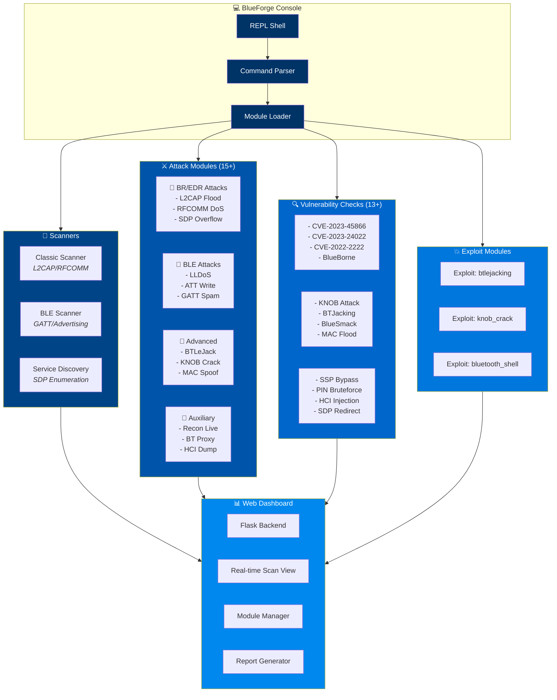

<div align="center">
  
</div>

<p align="center">
  
</p>

<p align="center">
  
  
  
  
  
  <br/>
  
  
  
  
  
  
</p>

<p align="center">
  <sub>Antes <b>bluesky</b> → Ahora <b>BlueForge-Suite</b> — Evolución completa del framework</sub>
</p>

---

## Arquitectura



---

## ⚡ Quick Start

```bash
# Clone
git clone https://github.com/Ruby570bocadito/BlueForge-Suite.git
cd BlueForge-Suite

# Install dependencies
pip install -r requirements.txt

# Launch console
python blueforge.py

# Launch web dashboard
python blueforge.py --web --port 5000

# Run scan
blueforge> use scanner/ble_scan
blueforge> set interface hci0
blueforge> run
```

---

## 🎯 Attack Modules (15+)

| Module | Type | Target | Description |
|--------|------|--------|-------------|
| `scanner/classic` | Scanner | BR/EDR | L2CAP/RFCOMM device discovery |
| `scanner/ble_scan` | Scanner | BLE | BLE advertising & GATT scan |
| `scanner/sdp_dump` | Scanner | SDP | Service Discovery Protocol enumeration |
| `attack/l2cap_flood` | Attack | BR/EDR | L2CAP connection flood DoS |
| `attack/rfcomm_dos` | Attack | BR/EDR | RFCOMM channel exhaustion DoS |
| `attack/sdp_overflow` | Attack | BR/EDR | SDP service attribute overflow |
| `attack/ble_lldos` | Attack | BLE | Link Layer ping flood DoS |
| `attack/ble_att_write` | Attack | BLE | ATT write request flood |
| `attack/gatt_spam` | Attack | BLE | GATT characteristic discovery spam |
| `attack/btlejack` | Attack | BLE | BTLEJack injection attack |
| `attack/knob_crack` | Attack | BR/EDR | KNOB attack entropy brute-force |
| `attack/mac_spoof` | Attack | Generic | Bluetooth MAC address spoofing |
| `attack/recon_live` | Auxiliary | Generic | Real-time device discovery & tracking |
| `attack/bt_proxy` | Auxiliary | Generic | Bluetooth proxy/intercept relay |
| `attack/hci_dump` | Auxiliary | Generic | HCI packet capture & analysis |
| `exploit/btlejacking` | Exploit | BLE | Full BTLEJack exploit chain |
| `exploit/knob_crack` | Exploit | BR/EDR | KNOB entropy reduction exploit |
| `exploit/bluetooth_shell` | Exploit | Generic | Bluetooth command shell injection |

---

## 🔍 Vulnerability Checks (13+)

| Check | Module | CVE/Reference | Impact |
|-------|--------|---------------|--------|
| BlueBorne | `vuln/blueborne` | CVE-2017-0781 | RCE via BT stack |
| KNOB Attack | `vuln/knob` | CVE-2019-9506 | Entropy downgrade to 1 byte |
| BlueSmack | `vuln/bluesmack` | CVE-2005-1234 | L2CAP ping-of-death DoS |
| BTJacking | `vuln/btjacking` | CVE-2018-5383 | Impersonation / pairing bypass |
| MAC Flooding | `vuln/mac_flood` | CVE-2020-26558 | Connection reset / tracking |
| SSP Bypass | `vuln/ssp_bypass` | CVE-2020-26557 | Secure Simple Pairing MitM |
| PIN BruteForce | `vuln/pin_brute` | CVE-2020-26556 | PIN cracking (6-digit) |
| HCI Injection | `vuln/hci_inject` | CVE-2021-31798 | HCI command injection |
| SDP Redirect | `vuln/sdp_redirect` | CVE-2020-26555 | SDP service record spoofing |
| CVE-2023-45866 | `vuln/cve_2023_45866` | CVE-2023-45866 | Auth bypass on Android/Linux |
| CVE-2023-24022 | `vuln/cve_2023_24022` | CVE-2023-24022 | BT stack info leak |
| CVE-2022-2222 | `vuln/cve_2022_2222` | CVE-2022-2222 | Double free in BlueZ |
| CVE-2024-xxxx | `vuln/cve_2024_check` | Reserved | Bleeding-edge CVE checks |

---

## 🖥️ Console Commands

| Command | Description |
|---------|-------------|
| `help` | Show available commands |
| `show modules` | List all loaded modules |
| `show options` | Show current module options |
| `use <module>` | Select a module to use |
| `set <option> <value>` | Set module option |
| `run` / `exploit` | Execute selected module |
| `back` | Unselect current module |
| `search <query>` | Search modules by keyword |
| `scan` | Run auto-discovery scan |
| `sessions -l` | List active sessions |
| `sessions -i <id>` | Interact with session |
| `history` | Show command history |
| `log` | Enable/disable session logging |
| `exit` / `quit` | Exit the console |
| `clear` | Clear terminal screen |
| `dashboard` | Launch web dashboard |

---

## 📊 Web Dashboard Preview

> Flask-based real-time web interface for scan monitoring and module management.

```
┌─────────────────────────────────────────────────┐
│  🔵 BlueForge Dashboard           [🔄] [⚙️] [❌] │
├─────────────────────────────────────────────────┤
│  ┌──────────┐  ┌──────────┐  ┌────────────────┐ │
│  │ Devices  │  │ Attacks  │  │    Alerts      │ │
│  │ Found: 12│  │ Running:3│  │  Critical: 2   │ │
│  │ BLE: 8   │  │ Queued: 5│  │  Warning: 4    │ │
│  │ Classic:4│  │ Done: 47 │  │  Info: 12      │ │
│  └──────────┘  └──────────┘  └────────────────┘ │
│  ┌──────────────────────────────────────────────┐│
│  │  [Live Scan Log]                            ││
│  │  [10:32:01] ✓ Device 00:11:22:33:44:55      ││
│  │  [10:32:03] ⚠ KNOB vulnerable found          ││
│  │  [10:32:05] ✗ Exploit failed: no target      ││
│  └──────────────────────────────────────────────┘│
└─────────────────────────────────────────────────┘
```

Access at `http://localhost:5000` after running `python blueforge.py --web`.

---

## 🛠️ Requirements

- Python 3.10+
- BlueZ (Linux) / PyBluez (Windows/macOS)
- `hcitool`, `gatttool`, `hcidump` (Linux)
- Dependencies: `pip install -r requirements.txt`

---

## 📄 License

**MIT License** — Free to use, modify, and distribute.

---

<div align="center">
  
  <br/><br/>
  <sub>
    Built with ❄️ by <a href="https://github.com/Ruby570bocadito">Ruby570bocadito</a> |
    <a href="https://github.com/Ruby570bocadito/BlueForge-Suite/issues">Report Issue</a> |
    <a href="https://github.com/Ruby570bocadito/BlueForge-Suite/discussions">Discussion</a>
  </sub>
</div>
