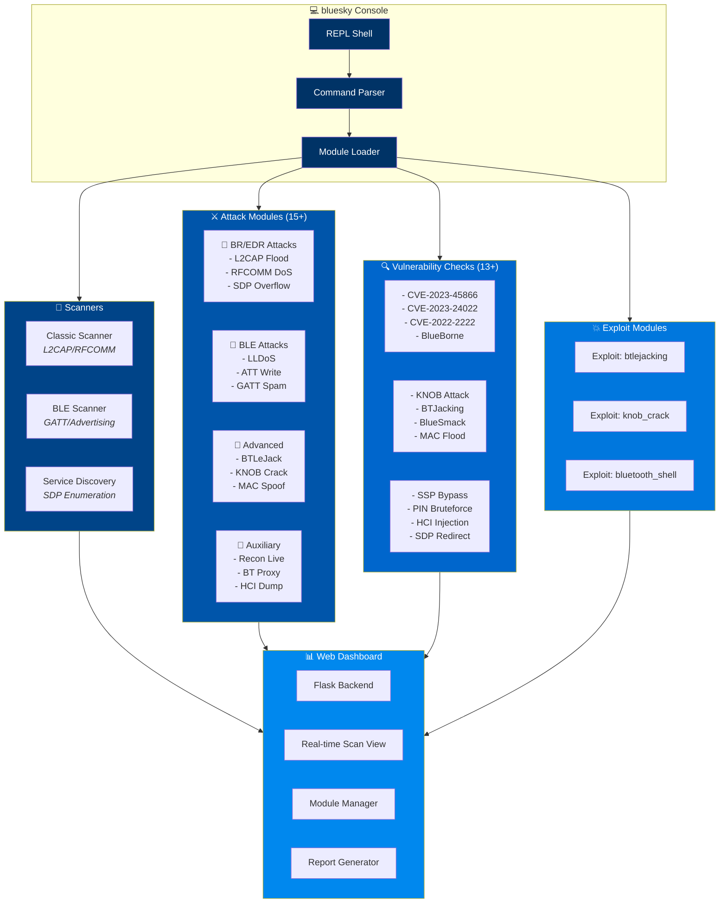

<div align="center">
  
</div>

<p align="center">
  
</p>

<p align="center">
  
  
  
  
  
  <br/>
  
  
  
  
  
  
  
</p>


---

## Arquitectura


```mermaid
graph TB
    subgraph CLI["💻 bluesky Console"]
        REPL["REPL Shell"]
        CMD["Command Parser"]
        LOAD["Module Loader"]
    end

    subgraph SCANNERS["📡 Scanners"]
        S1["Classic Scanner<br/><i>L2CAP/RFCOMM</i>"]
        S2["BLE Scanner<br/><i>GATT/Advertising</i>"]
        S3["Service Discovery<br/><i>SDP Enumeration</i>"]
    end

    subgraph ATTACKS["⚔️ Attack Modules (15+)"]
        A1["🔹 BR/EDR Attacks<br/>- L2CAP Flood<br/>- RFCOMM DoS<br/>- SDP Overflow"]
        A2["🔹 BLE Attacks<br/>- LLDoS<br/>- ATT Write<br/>- GATT Spam"]
        A3["🔹 Advanced<br/>- BTLeJack<br/>- KNOB Crack<br/>- MAC Spoof"]
        A4["🔹 Auxiliary<br/>- Recon Live<br/>- BT Proxy<br/>- HCI Dump"]
    end

    subgraph VULNS["🔍 Vulnerability Checks (13+)"]
        V1["- CVE-2023-45866<br/>- CVE-2023-24022<br/>- CVE-2022-2222<br/>- BlueBorne"]
        V2["- KNOB Attack<br/>- BTJacking<br/>- BlueSmack<br/>- MAC Flood"]
        V3["- SSP Bypass<br/>- PIN Bruteforce<br/>- HCI Injection<br/>- SDP Redirect"]
    end

    subgraph EXPLOITS["💥 Exploit Modules"]
        E1["Exploit: btlejacking"]
        E2["Exploit: knob_crack"]
        E3["Exploit: bluetooth_shell"]
    end

    subgraph DASHBOARD["📊 Web Dashboard"]
        W1["Flask Backend"]
        W2["Real-time Scan View"]
        W3["Module Manager"]
        W4["Report Generator"]
    end

    REPL --> CMD --> LOAD
    LOAD --> SCANNERS
    LOAD --> ATTACKS
    LOAD --> VULNS
    LOAD --> EXPLOITS
    SCANNERS --> DASHBOARD
    ATTACKS --> DASHBOARD
    VULNS --> DASHBOARD
    EXPLOITS --> DASHBOARD

    style REPL fill:#003366,color:#fff
    style CMD fill:#003366,color:#fff
    style LOAD fill:#003366,color:#fff
    style SCANNERS fill:#004488,color:#fff
    style ATTACKS fill:#0055AA,color:#fff
    style VULNS fill:#0066CC,color:#fff
    style EXPLOITS fill:#0077DD,color:#fff
    style DASHBOARD fill:#0088EE,color:#fff
```

---

## ⚡ Quick Start

```bash
# Clone
git clone https://github.com/Ruby570bocadito/bluesky.git
cd bluesky

# Install dependencies
pip install -r requirements.txt

# Launch console
python -m bluesky

# Launch web dashboard
python -m bluesky web --port 5000

# Run scan
bluesky> use scanner/ble_scan
bluesky> set interface hci0
bluesky> run
```

---

## 🎯 Attack Modules (15+)

| Module | Type | Target | Description |
|--------|------|--------|-------------|
| `scanner/device_scanner` | Scanner | BR/EDR + BLE | Classic & BLE device discovery |
| `scanner/service_scanner` | Scanner | SDP | SDP service enumeration |
| `scanner/vuln_scanner` | Scanner | All | 13+ CVE vulnerability checks |
| `attack/knob` | Attack | BR/EDR | KNOB attack entropy brute-force |
| `attack/bias` | Attack | BR/EDR | BIAS attack (Bluetooth Impersonation) |
| `attack/bluffs` | Attack | BR/EDR | BLUFFS attack (Bluetooth Forward/Future Secrecy) |
| `attack/blueborne` | Attack | BR/EDR | BlueBorne RCE exploit |
| `attack/bluefrag` | Attack | BLE | BlueFrag RCE (Android BLE) |
| `attack/blesa` | Attack | BLE | BLESA connection re-establishment attack |
| `attack/bluejacking` | Attack | Generic | BlueJacking (OBEX push spam) |
| `attack/bluesnarfing` | Attack | Generic | BlueSnarfing (OBEX data pull) |
| `attack/bluebugging` | Attack | Generic | BlueBugging (AT command injection) |
| `attack/sweyntooth` | Attack | BLE | SweynTooth BLE DoS/RCE suite |
| `attack/whisperpair` | Attack | BLE | WhisperPair pairing bypass |
| `attack/crackle` | Attack | BLE | Crackle BLE encryption cracker |
| `attack/btlejack` | Attack | BLE | BTLEJack injection & sniffing |
| `attack/btspam` | Attack | Generic | BTSpam flood (3 techniques) |
| `attack/autopilot` | Auxiliary | All | 4-phase auto scan→detect→attack→report |
| `exploit/keystroke_injection` | Exploit | HID | Bluetooth keystroke injection |
| `exploit/l2cap_fuzz` | Exploit | L2CAP | L2CAP protocol fuzzing |
| `exploit/rfcomm_shell` | Exploit | RFCOMM | RFCOMM reverse shell |

---

## 🔍 Vulnerability Checks (13+)

| Check | Module | CVE/Reference | Impact |
|-------|--------|---------------|--------|
| BlueBorne | `vuln/blueborne` | CVE-2017-0781 | RCE via BT stack |
| KNOB Attack | `vuln/knob` | CVE-2019-9506 | Entropy downgrade to 1 byte |
| BlueSmack | `vuln/bluesmack` | CVE-2005-1234 | L2CAP ping-of-death DoS |
| BTJacking | `vuln/btjacking` | CVE-2018-5383 | Impersonation / pairing bypass |
| MAC Flooding | `vuln/mac_flood` | CVE-2020-26558 | Connection reset / tracking |
| SSP Bypass | `vuln/ssp_bypass` | CVE-2020-26557 | Secure Simple Pairing MitM |
| PIN BruteForce | `vuln/pin_brute` | CVE-2020-26556 | PIN cracking (6-digit) |
| HCI Injection | `vuln/hci_inject` | CVE-2021-31798 | HCI command injection |
| SDP Redirect | `vuln/sdp_redirect` | CVE-2020-26555 | SDP service record spoofing |
| CVE-2023-45866 | `vuln/cve_2023_45866` | CVE-2023-45866 | Auth bypass on Android/Linux |
| CVE-2023-24022 | `vuln/cve_2023_24022` | CVE-2023-24022 | BT stack info leak |
| CVE-2022-2222 | `vuln/cve_2022_2222` | CVE-2022-2222 | Double free in BlueZ |
| CVE-2024-xxxx | `vuln/cve_2024_check` | Reserved | Bleeding-edge CVE checks |

---

## 🖥️ Console Commands

| Command | Description |
|---------|-------------|
| `help` | Show available commands |
| `show modules` | List all loaded modules |
| `show options` | Show current module options |
| `use <module>` | Select a module to use |
| `set <option> <value>` | Set module option |
| `run` / `exploit` | Execute selected module |
| `back` | Unselect current module |
| `search <query>` | Search modules by keyword |
| `educate [módulo]` | Explicación educativa paso a paso (qué es, cómo funciona, mitigación) |
| `scan` | Run auto-discovery scan |
| `sessions -l` | List active sessions |
| `sessions -i <id>` | Interact with session |
| `history` | Show command history |
| `log` | Enable/disable session logging |
| `exit` / `quit` | Exit the console |
| `clear` | Clear terminal screen |
| `dashboard` | Launch web dashboard |

---

## 📊 Web Dashboard

> Interfaz web minimalista y 100% offline (sin CDN ni fuentes externas) para monitorizar escaneos, explorar el catálogo de módulos y consultar el modo educativo.


Características:

- **Dashboard en vivo** — estado del adaptador, uptime, distribución de severidad del catálogo y actividad reciente con auto-refresh.
- **Catálogo de módulos** — filtrado por nombre/tipo, con detalle por módulo, opciones y referencias CVE.
- **Modo educativo integrado** — cada módulo incluye su explicación paso a paso y cómo mitigarlo, tanto en web como en CLI.
- **Escaneo en vivo** — lanza inquiry/BLE o enumeración SDP/GATT desde el navegador con resultados en tiempo real.
- **Sesiones, reportes y logs** — visor integrado con renderizado seguro (`textContent`, sin inyección de markup) y protección contra *path traversal* en la API de reportes.

Accede en `http://localhost:5000` tras ejecutar `python -m bluesky web`.

---

## 🎓 Modo Educativo

Cada módulo documenta **qué es, cómo funciona paso a paso, su impacto y cómo mitigarlo**. Diseñado para formación en seguridad Bluetooth con foco en el defensor:

```bash
# Desde el CLI
bluesky educate              # índice de contenidos
bluesky educate knob         # KNOB (CVE-2019-9506) explicado

# Desde la consola REPL
bluesky> educate bias

# Desde la web
# Módulos → knob → sección "Modo educativo"
```

Cobertura: los 22 módulos del catálogo (ataques, escáneres, exploits y plugins) incluyen contenido educativo con mitigaciones accionables.
---

## 🛠️ Requirements

- Python 3.10+
- BlueZ (Linux) / PyBluez (Windows/macOS)
- `hcitool`, `gatttool`, `hcidump` (Linux)
- Dependencies: `pip install -r requirements.txt`

---

## 📄 License

**MIT License** — Free to use, modify, and distribute.

---

<div align="center">
  
  <br/><br/>
  <sub>
    Built with ❄️ by <a href="https://github.com/Ruby570bocadito">Ruby570bocadito</a> |
    <a href="https://github.com/Ruby570bocadito/bluesky/issues">Report Issue</a> |
    <a href="https://github.com/Ruby570bocadito/bluesky/discussions">Discussion</a>
  </sub>
</div>
