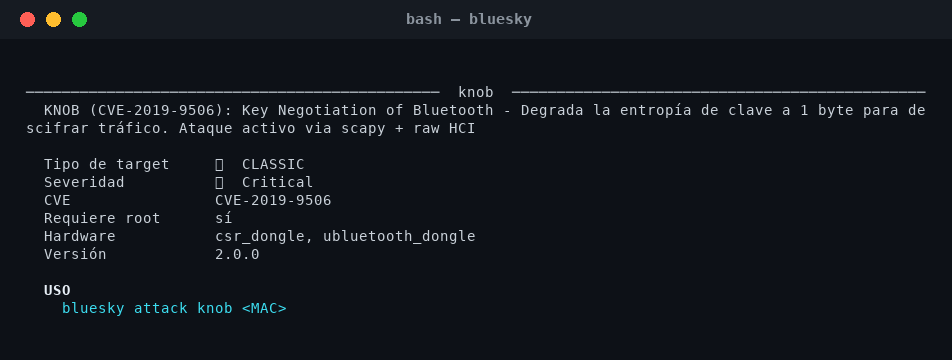
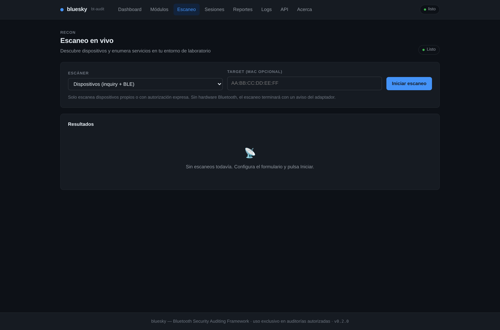
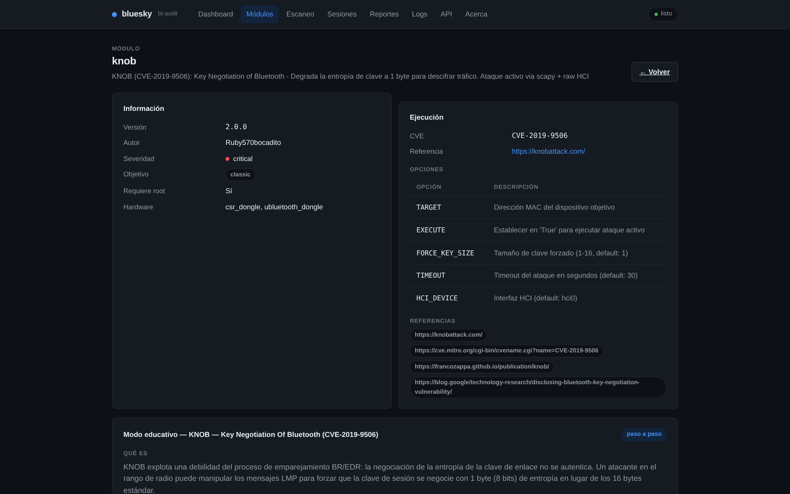

<p align="center">
  
</p>

# bluesky

**Framework de auditoría de seguridad Bluetooth — estilo Metasploit, en Python.**

Escáneres BR/EDR y BLE · 21 módulos de ataque y exploit · 13+ checks de vulnerabilidades · consola REPL · dashboard web · modo educativo · **cero código simulado**.

[](https://www.python.org/)
[](https://github.com/Ruby570bocadito/bluesky/actions)
[](https://github.com/Ruby570bocadito/bluesky/actions)
[](#compatibilidad)
[](LICENSE)

## Demo


<p align="center"><em>Sesión real: catálogo, consulta OUI, modo educativo y dashboard web (33 s).</em></p>

[Ver el video en GitHub](https://github.com/Ruby570bocadito/bluesky/blob/main/docs/assets/demo_bluesky.mp4)

<p align="center">
  
</p>
<p align="center"><em>GIF: sesión real de la CLI (catálogo, OUI lookup y modo educativo).</em></p>

## ¿Qué es?

bluesky es un framework modular para **auditar dispositivos Bluetooth clásicos y BLE** de forma organizada y repetible: descubre dispositivos cercanos, enumera sus servicios, los analiza contra un catálogo de vulnerabilidades conocidas (KNOB, BIAS, BLUFFS, BlueBorne, SweynTooth…) y ejecuta módulos de prueba siguiendo el flujo `use → set → run` de Metasploit. Todo el ciclo queda registrado en sesiones y se exporta a reportes en TXT, HTML o JSON.

**Sin humo: los módulos hacen solo lo que el hardware permite.** Cuando falta un adaptador, una herramienta o los permisos, el módulo lo dice con claridad y te indica exactamente qué necesitas para ejecutar el ataque real — nunca inventa resultados. Los módulos avanzados delegan en herramientas reales de referencia (`btlejack`, `hcidump`, `sdptool`, PyBlueZ) y el cracking de claves BLE usa el algoritmo SMP real (AES-128 vía `cryptography`).

Está pensado como herramienta de **formación y auditoría autorizada**: cada módulo incluye un modo educativo que explica qué hace, cómo funciona paso a paso y cómo mitigarlo. El dashboard web y el catálogo de módulos están 100% offline (sin CDNs ni llamadas externas).

> ⚠️ **Uso ético.** Ejecuta bluesky únicamente sobre equipos y redes para los que tengas autorización explícita. El autor no se hace responsable del mal uso.

## Características

- **3 escáneres** — descubrimiento BR/EDR + BLE, enumeración SDP y análisis de vulnerabilidades (13+ checks con CVE).
- **Identificación de fabricante (OUI)** — cada dispositivo descubierto se anota con su fabricante a partir del prefijo MAC (base offline integrada: Apple, Samsung, Raspberry Pi, CSR, Xiaomi…).
- **Exportación CSV/JSON** — `bluesky scan --export dispositivos.csv` y botón "Exportar CSV" en la web.
- **21 módulos de ataque/exploit** — KNOB, BIAS, BLUFFS, BlueBorne, BlueFrag, BLESA, SweynTooth, WhisperPair, Crackle, BTLEJack, BlueSmack, inyección de teclas, fuzzing L2CAP y shell RFCOMM.
- **Contrato honesto** — sin hardware o sin herramientas, `success=false` + requisitos exactos (qué instalar, qué dongle, qué permisos). Cero datos fabricados.
- **Cracking SMP real** — Crackle captura con `hcidump`, recupera LTK de `SM_Encryption_Information` y deriva STK con `s1()` = AES-128 real.
- **Plugin de ejemplo funcional** — `plugins/oui_lookup.py` muestra el sistema de plugins con una utilidad real (consulta OUI por MAC).
- **Consola REPL** estilo Metasploit con autocompletado, favoritos y sesiones persistentes.
- **CLI moderno** — argparse con ayuda por comando, exit codes consistentes (0/1/2), salida `--json` para scripting y modo `--no-color`.
- **Autopilot** — pipeline automático de 4 fases: escaneo → detección de vulnerabilidades → cadena de ataques → reporte.
- **Modo educativo** — cada módulo documentado: qué es, cómo funciona, impacto y mitigaciones (en CLI, consola y web).
- **Dashboard web** — Flask, en modo oscuro, con escaneo en vivo, catálogo de módulos, sesiones, reportes y logs; renderizado seguro sin inyección de markup.
- **Multiplataforma** — Linux (BlueZ), Windows, Termux (Android) y WSL, con detección automática de backends.

## Instalación

```bash
git clone https://github.com/Ruby570bocadito/bluesky.git
cd bluesky
pip install -r requirements.txt

# (opcional) instalar como comando global
pip install .
```

En Termux: `bash scripts/install_termux.sh` · En Windows: `scripts/install_windows.ps1` · Docker: `docker-compose up`.

Dependencias opcionales según lo que quieras ejecutar (todas documentadas en cada módulo): `scapy` (ataques activos), `pybluez` (envío L2CAP de BlueFrag), `cryptography` (AES de Crackle), herramienta `btlejack` (hijacking BLE), `bluez-hcidump` (capturas).

Scripts auxiliares: `scripts/bluesky-termux.sh` (launcher en Termux) y `scripts/build_pyinstaller.sh` (binario standalone; genera su propio spec).

## Inicio rápido

```bash
# Estado del hardware Bluetooth
bluesky status

# Escanear dispositivos (BLE o clásico) y exportarlos a CSV
bluesky scan --ble --timeout 12 --export dispositivos.csv

# Analizar vulnerabilidades de un dispositivo
bluesky vuln AA:BB:CC:DD:EE:FF

# Ejecutar un módulo
bluesky attack bluejacking AA:BB:CC:DD:EE:FF

# Consultar el fabricante de una MAC (plugin real, 100% offline)
bluesky attack oui_lookup B8:27:EB:12:34:56

# Pipeline automático
bluesky auto --mode detect

# Consola interactiva
bluesky console
```

```text
$ bluesky console
bluesky > use scanner/ble_scan
bluesky (ble_scan) > set interface hci0
bluesky (ble_scan) > run
```


## CLI

| Comando | Descripción |
|---------|-------------|
| `scan [--ble\|--classic] [--timeout S] [--export F]` | Escanear dispositivos cercanos (con fabricante OUI) |
| `services <MAC>` | Enumerar servicios SDP |
| `vuln <MAC> [--options JSON]` | Análisis de vulnerabilidades (13+ checks) |
| `attack <módulo> [MAC] [--options JSON]` | Ejecutar un módulo del catálogo |
| `auto [MAC] [--mode detect\|attack\|full]` | Autopilot de 4 fases |
| `spam <MAC\|all> [--method M] [--rate N]` | BTSpam: inundación (3 técnicas) |
| `list` / `info <módulo>` | Catálogo y detalle de módulos |
| `educate [módulo]` | Modo educativo |
| `status` | Adaptador, capacidades y backends |
| `session list\|save\|load\|summary` | Gestión de sesiones |
| `report [--html\|--json\|--txt] [-o FILE]` | Reporte de la sesión |
| `config` / `plugin` / `web` / `console` | Configuración, plugins, dashboard, REPL |

Opciones globales: `--config <archivo>` · `--json` (salida para scripting) · `--no-color` · `--version`.

Exit codes: `0` OK · `1` error de ejecución · `2` error de uso. Cada comando incluye ayuda propia: `bluesky scan --help`.



## Módulos

| Módulo | Tipo | Target | Descripción |
|--------|------|--------|-------------|
| `scanner/device_scanner` | Escáner | BR/EDR + BLE | Descubrimiento de dispositivos |
| `scanner/service_scanner` | Escáner | SDP | Enumeración de servicios |
| `scanner/vuln` | Escáner | Todos | 13+ checks de vulnerabilidades |
| `attack/knob` | Ataque | BR/EDR | Degradación de entropía (CVE-2019-9506) |
| `attack/bias` | Ataque | BR/EDR | Suplantación de identidad (CVE-2020-10135) |
| `attack/bluffs` | Ataque | BR/EDR | Forward/Future Secrecy (CVE-2023-20023) |
| `attack/blueborne` | Ataque | BR/EDR | RCE vía pila BT (CVE-2017-0781) |
| `attack/bluefrag` | Ataque | BLE | RCE en Android (CVE-2020-0022) |
| `attack/blesa` | Ataque | BLE | Reestablecimiento de conexión inseguro |
| `attack/bluejacking` | Ataque | Genérico | OBEX push no solicitado |
| `attack/bluesnarfing` | Ataque | Genérico | Extracción de datos OBEX |
| `attack/bluebugging` | Ataque | Genérico | Inyección de comandos AT |
| `attack/sweyntooth` | Ataque | BLE | Suite DoS/RCE (6 CVEs) |
| `attack/whisperpair` | Ataque | BLE | Bypass de emparejamiento Fast Pair |
| `attack/crackle` | Ataque | BLE | Recuperación de LTK/STK (SMP real, AES-128) |
| `attack/btlejack` | Ataque | BLE | Hijacking/sniffing (delegación a btlejack) |
| `attack/btspam` | Ataque | Genérico | Inundación (3 técnicas) |
| `attack/autopilot` | Auxiliar | Todos | Pipeline automático de auditoría |
| `exploit/keystroke_injection` | Exploit | HID | Inyección de teclas |
| `exploit/l2cap_fuzz` | Exploit | L2CAP | Fuzzing de protocolo |
| `exploit/rfcomm_shell` | Exploit | RFCOMM | Shell interactiva |
| `oui_lookup` *(plugin)* | Utilidad | MAC | Fabricante por OUI (offline) |

`bluesky list` agrupa el catálogo por severidad y `bluesky info <módulo>` muestra CVE, hardware requerido y uso.


## Modo educativo

Cada módulo documenta **qué es, cómo funciona paso a paso, su impacto y cómo mitigarlo** — con foco en el defensor:

```bash
bluesky educate              # índice de contenidos
bluesky educate knob         # KNOB (CVE-2019-9506) explicado

bluesky> educate bias        # desde la consola REPL
```

También en la web: **Módulos → knob → Modo educativo**. Cobertura completa del catálogo (22 módulos).

## Web dashboard

Interfaz web **minimalista en modo oscuro**, 100% offline (sin CDN ni fuentes externas), con renderizado seguro (`textContent`), middleware CSRF en los endpoints POST y protección contra path traversal en la API de reportes.

```bash
bluesky web --port 5000 --open
```




- **Dashboard en vivo** — estado del adaptador, distribución de severidad y actividad con auto-refresh.
- **Catálogo de módulos** — filtrado por nombre/tipo con detalle, opciones y CVEs.
- **Escaneo en vivo con opciones** — inquiry/BLE o enumeración SDP/GATT desde el navegador, con elección de modo (Classic/BLE) y timeout.
- **Dispositivos descubiertos** — tabla en vivo con MAC, nombre, tipo, fabricante (OUI) y RSSI, exportable a CSV con un clic.
- **Sesiones, reportes y logs** — visores integrados con renderizado seguro.




## Compatibilidad

| Plataforma | Estado | Notas |
|------------|--------|-------|
| Linux (BlueZ) | ✅ Completo | `hcitool`, `gatttool`, `hcidump`; CSR dongles soportados |
| Windows | ✅ Completo | Backend propio vía WinRT/Bleak |
| Termux (Android) | ✅ Completo | Backend `termux-bluetooth` |
| WSL | ⚠️ Limitado | Sin acceso USB BT directo |

## Tests y calidad

```bash
python -m pytest tests/ -q     # 406 tests, 100% offline
```

CI en GitHub Actions: suite completa en cada push + lint con ruff. Cobertura de regresión en `tests/test_qa_*.py` (path traversal, XSS, CSRF, contractos de módulos, serialización JSON de resultados).

## Estructura

```text
bluesky/
├── bluesky/
│   ├── core/          # motor, sesiones, hardware, reporter, educación
│   ├── modules/       # scanners/ · attacks/ · exploits/
│   ├── utils/         # config, OUI, CSV, backends de plataforma
│   └── web/           # dashboard Flask (app + plantillas + estáticos)
├── plugins/           # oui_lookup.py: plugin de ejemplo (funcionalidad real)
├── scripts/           # instalación (Linux/Windows/Termux), build, completions
├── tests/             # 406 tests offline
└── docs/
    ├── assets/        # portada, GIF, video y capturas reales (CLI y web)
    └── ANALISIS_BLUETOOTH.md   # análisis técnico: top 10 ataques BT
```

## Aprende más

- [Análisis completo: Top 10 ataques Bluetooth](docs/ANALISIS_BLUETOOTH.md) — base técnica del catálogo de módulos.

## Licencia

[MIT](LICENSE) — libre de usar, modificar y distribuir.

<div align="center">
  <sub>Construido por <a href="https://github.com/Ruby570bocadito">Ruby570bocadito</a> · <a href="https://github.com/Ruby570bocadito/bluesky/issues">Issues</a> · <a href="https://github.com/Ruby570bocadito/bluesky/discussions">Discusiones</a></sub>
</div>
