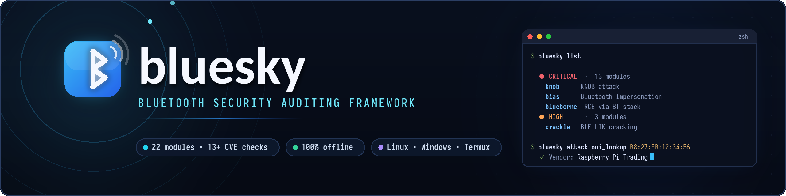
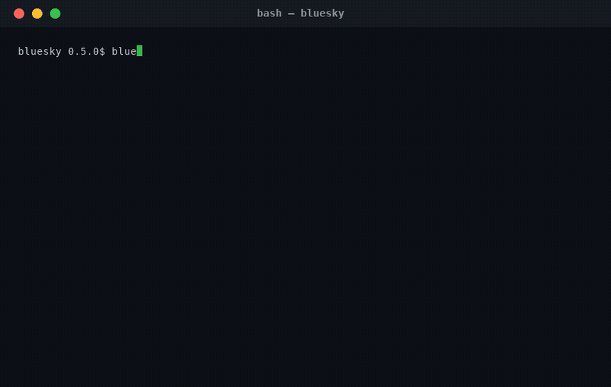
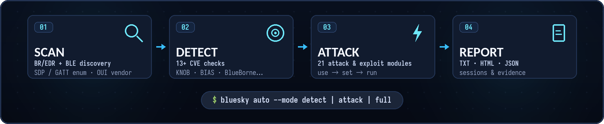
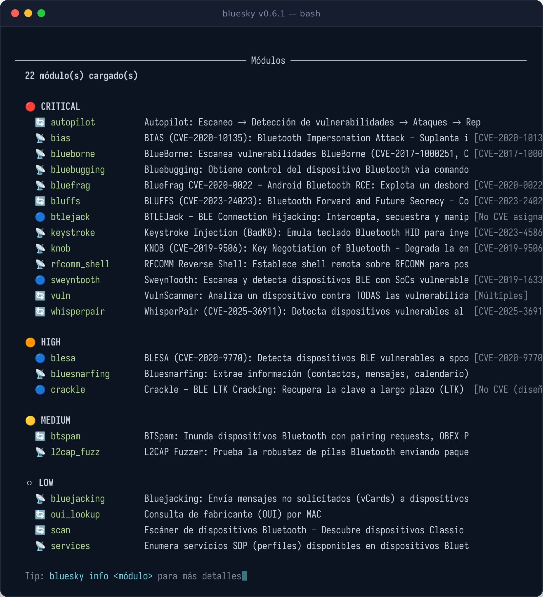
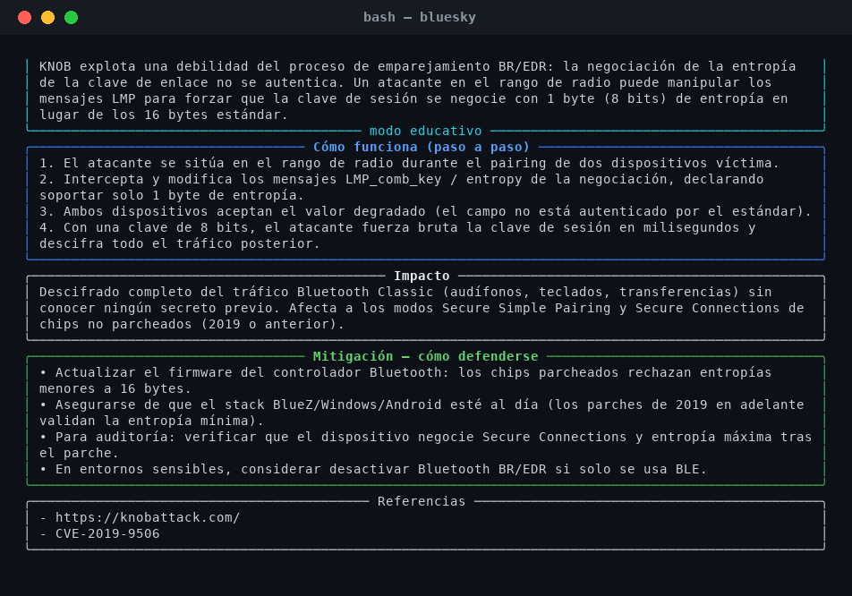
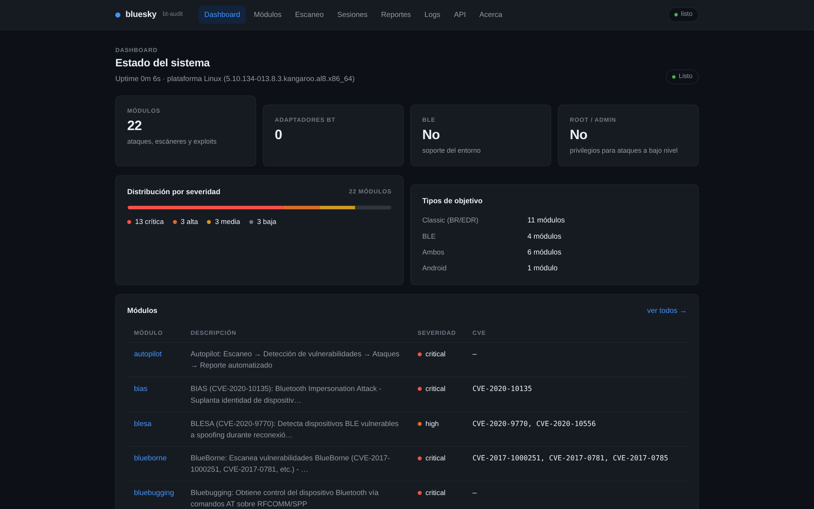
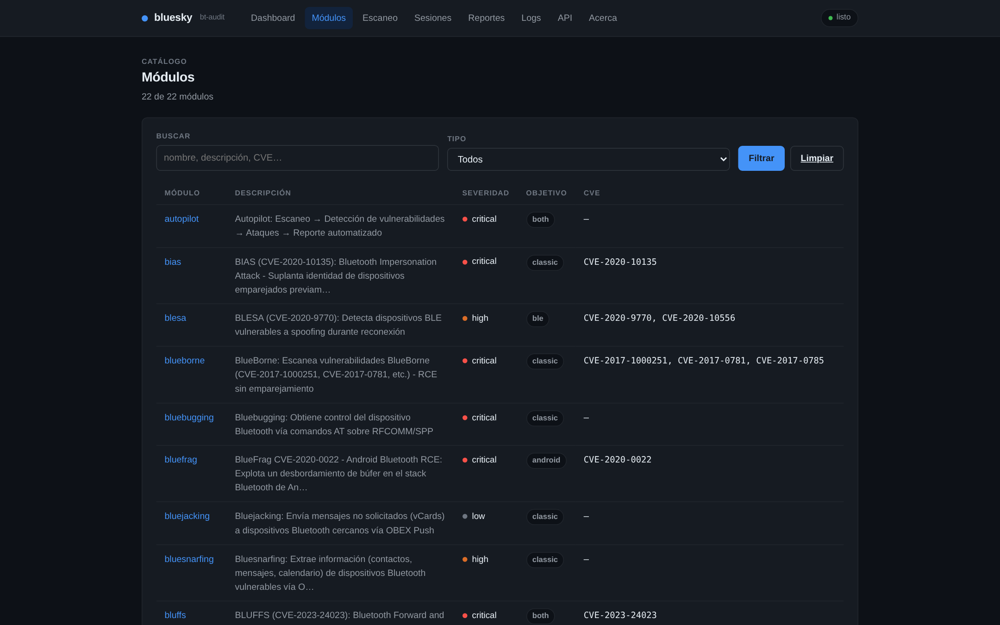
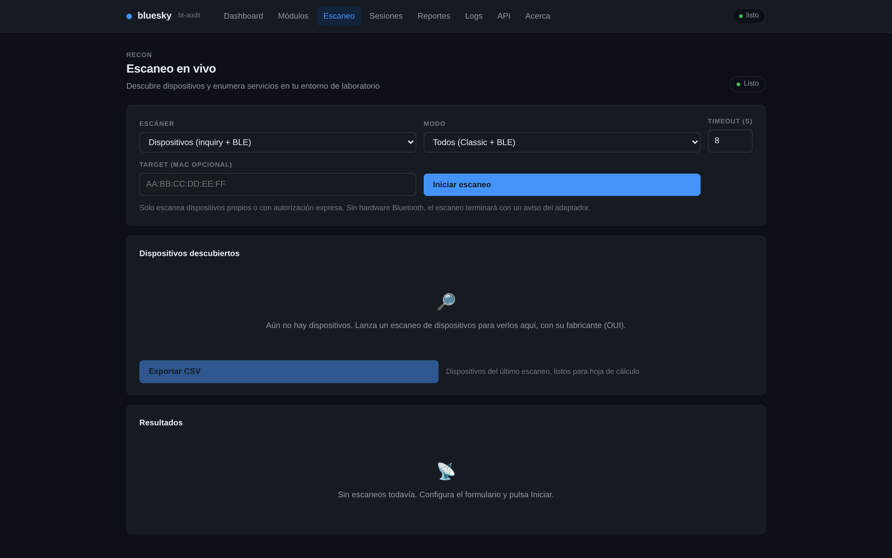
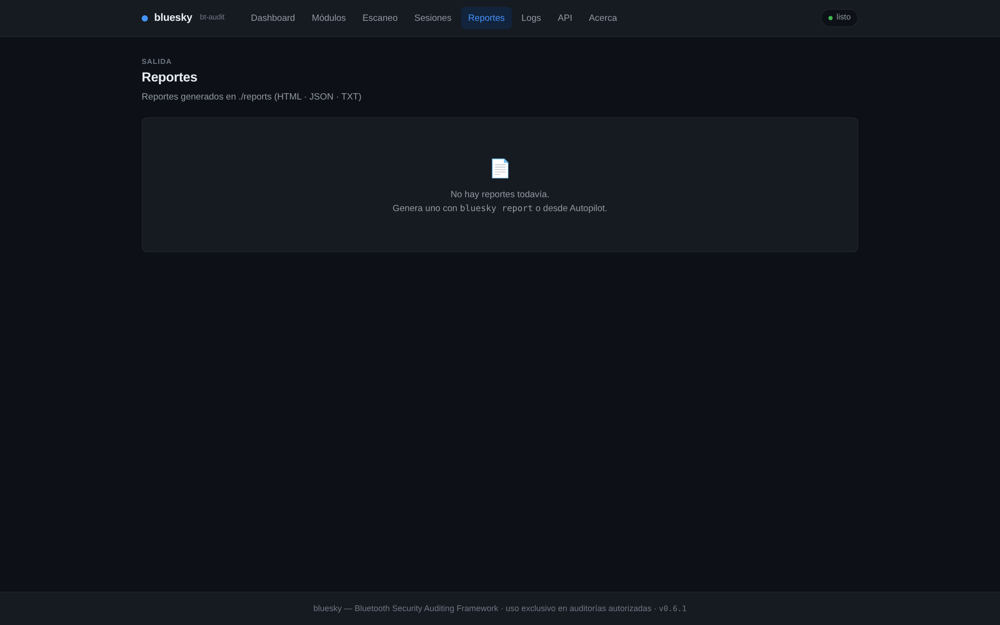

<p align="center">
  
</p>

<p align="center">
  <strong>A Metasploit-style Bluetooth security auditing framework, written in Python.</strong><br>
  BR/EDR &amp; BLE scanners · 21 attack &amp; exploit modules · 13+ CVE checks · REPL console · web dashboard · <strong>zero simulated results</strong>
</p>

<p align="center">
  <a href="https://www.python.org/"></a>
  <a href="https://github.com/Ruby570bocadito/bluesky/actions"></a>
  
  <a href="#compatibility"></a>
  <a href="LICENSE"></a>
  
</p>

---

## Demo

<p align="center">
  
</p>
<p align="center"><em>Live CLI (v0.6.0): module intel for KNOB, 100% offline OUI vendor lookup and the educational mode — real output, nothing staged.</em></p>


<p align="center"><em>Full session — module catalog, OUI lookup, educational mode and web dashboard (33 s) · <a href="docs/assets/demo_bluesky.mp4">open the video</a></em></p>

## What is bluesky?

**bluesky** is a modular framework for auditing **Bluetooth Classic and BLE devices** in an organized, repeatable way: discover nearby devices, enumerate their services, check them against a catalog of known vulnerabilities (KNOB, BIAS, BLUFFS, BlueBorne, SweynTooth…) and run proof-of-concept modules following the Metasploit-style `use → set → run` flow. The whole cycle is recorded into sessions and can be exported as TXT, HTML or JSON reports.

**No smoke and mirrors: modules only do what the hardware allows.** When an adapter, a tool or a permission is missing, the module says so clearly and tells you exactly what you need to run the real attack — it never invents results. Advanced modules delegate to real reference tools (`btlejack`, `hcidump`, `sdptool`, PyBlueZ) and BLE key cracking uses the real SMP algorithm (AES-128 via `cryptography`).

It is designed as a **training and authorized-audit tool**: every module ships with an educational mode that explains what it does, how it works step by step and how to mitigate it. The web dashboard and the module catalog are 100% offline — no CDNs, no external calls.

> ⚠️ **Ethical use.** Run bluesky only against devices and networks you have explicit written permission to test. The author is not responsible for misuse.

## How it works

From discovery to evidence in four phases — each step feeds the next, everything is recorded into the session, and the whole audit can be driven by a single command:

<p align="center">
  
</p>

Autopilot picks modules automatically based on the vulnerabilities it finds (`detect` only reports, `attack` chains modules against a target, `full` runs the end-to-end audit) and every module can still be run à la carte from the CLI, the REPL console or the web dashboard.

## Features

- **3 scanners** — BR/EDR + BLE discovery, SDP service enumeration and vulnerability analysis (13+ CVE-backed checks).
- **OUI vendor identification** — every discovered device is annotated with its manufacturer from the MAC prefix (built-in offline database: Apple, Samsung, Raspberry Pi, CSR, Xiaomi…).
- **CSV/JSON export** — `bluesky scan --export devices.csv`, plus a one-click *Export CSV* button in the web UI.
- **21 attack/exploit modules** — KNOB, BIAS, BLUFFS, BlueBorne, BlueFrag, BLESA, SweynTooth, WhisperPair, Crackle, BTLEJack, BlueSmack, keystroke injection, L2CAP fuzzing and an RFCOMM shell.
- **Honest contract** — no hardware or missing tools → `success=false` plus the exact requirements (what to install, which dongle, which permissions). Zero fabricated data.
- **Real SMP cracking** — Crackle captures with `hcidump`, recovers the LTK from `SM_Encryption_Information` and derives the STK with the real `s1()` = AES-128.
- **Working sample plugin** — `plugins/oui_lookup.py` showcases the plugin system with a real utility (OUI lookup by MAC).
- **Metasploit-style REPL console** — autocompletion, favorites and persistent sessions.
- **Modern CLI** — argparse with per-command help, consistent exit codes (0/1/2), `--json` output for scripting and a `--no-color` mode.
- **Autopilot** — automated 4-phase pipeline: scan → vulnerability detection → attack chain → report.
- **Educational mode** — every module documented: what it is, how it works, its impact and mitigations (in the CLI, console and web UI).
- **Web dashboard** — Flask, dark mode, live scanning, module catalog, sessions, reports and logs; safe rendering with no markup injection.
- **Cross-platform** — Linux (BlueZ), Windows, Termux (Android) and WSL, with automatic backend detection.

## Installation

```bash
git clone https://github.com/Ruby570bocadito/bluesky.git
cd bluesky
pip install -r requirements.txt

# (optional) install as a global command
pip install .
```

| Platform | Install |
|----------|---------|
| Linux / macOS | `pip install -r requirements.txt` |
| Termux (Android) | `bash scripts/install_termux.sh` |
| Windows | `scripts/install_windows.ps1` |
| Docker | `docker-compose up` |

Optional dependencies depending on what you want to run (all documented inside each module): `scapy` (active attacks), `pybluez` (BlueFrag L2CAP send), `cryptography` (Crackle AES), the `btlejack` tool (BLE hijacking) and `bluez-hcidump` (captures).

Helper scripts: `scripts/bluesky-termux.sh` (Termux launcher) and `scripts/build_pyinstaller.sh` (standalone binary; generates its own spec file).

## Quick start

```bash
# Bluetooth hardware status
bluesky status

# Scan for devices (BLE or Classic) and export them to CSV
bluesky scan --ble --timeout 12 --export devices.csv

# Analyze a device for vulnerabilities
bluesky vuln AA:BB:CC:DD:EE:FF

# Run a module
bluesky attack bluejacking AA:BB:CC:DD:EE:FF

# Look up the vendor of a MAC address (real plugin, 100% offline)
bluesky attack oui_lookup B8:27:EB:12:34:56

# Automated pipeline
bluesky auto --mode detect

# Interactive console
bluesky console
```

```text
$ bluesky console
bluesky > use scanner/ble_scan
bluesky (ble_scan) > set interface hci0
bluesky (ble_scan) > run
```

Global options: `--config <file>` · `--json` (script-friendly output) · `--no-color` · `--version`.
Exit codes: `0` OK · `1` execution error · `2` usage error. Every command ships its own help: `bluesky scan --help`.

## CLI reference

| Command | Description |
|---------|-------------|
| `scan [--ble\|--classic] [--timeout S] [--export F]` | Scan nearby devices (with OUI vendor lookup) |
| `services <MAC>` | Enumerate SDP services |
| `vuln <MAC> [--options JSON]` | Vulnerability analysis (13+ checks) |
| `attack <module> [MAC] [--options JSON]` | Run a module from the catalog |
| `auto [MAC] [--mode detect\|attack\|full]` | 4-phase autopilot |
| `spam <MAC\|all> [--method M] [--rate N]` | BTSpam: flooding (3 techniques) |
| `list` / `info <module>` | Module catalog and details |
| `educate [module]` | Educational mode |
| `status` | Adapter, capabilities and backends |
| `session list\|save\|load\|summary` | Session management |
| `report [--html\|--json\|--txt] [-o FILE]` | Session report |
| `config` / `plugin` / `web` / `console` | Configuration, plugins, dashboard, REPL |

## Modules

| Module | Type | Target | Description |
|--------|------|--------|-------------|
| `scanner/device_scanner` | Scanner | BR/EDR + BLE | Device discovery |
| `scanner/service_scanner` | Scanner | SDP | Service enumeration |
| `scanner/vuln` | Scanner | All | 13+ vulnerability checks |
| `attack/knob` | Attack | BR/EDR | Entropy downgrade (CVE-2019-9506) |
| `attack/bias` | Attack | BR/EDR | Identity impersonation (CVE-2020-10135) |
| `attack/bluffs` | Attack | BR/EDR | Forward/Future Secrecy (CVE-2023-20023) |
| `attack/blueborne` | Attack | BR/EDR | RCE via the BT stack (CVE-2017-0781) |
| `attack/bluefrag` | Attack | BLE | Android RCE (CVE-2020-0022) |
| `attack/blesa` | Attack | BLE | Insecure connection re-establishment |
| `attack/bluejacking` | Attack | Generic | Unsolicited OBEX push |
| `attack/bluesnarfing` | Attack | Generic | OBEX data extraction |
| `attack/bluebugging` | Attack | Generic | AT command injection |
| `attack/sweyntooth` | Attack | BLE | DoS/RCE suite (6 CVEs) |
| `attack/whisperpair` | Attack | BLE | Fast Pair pairing bypass |
| `attack/crackle` | Attack | BLE | LTK/STK recovery (real SMP, AES-128) |
| `attack/btlejack` | Attack | BLE | Hijacking/sniffing (delegates to btlejack) |
| `attack/btspam` | Attack | Generic | Flooding (3 techniques) |
| `attack/autopilot` | Auxiliary | All | Automated audit pipeline |
| `exploit/keystroke_injection` | Exploit | HID | Keystroke injection |
| `exploit/l2cap_fuzz` | Exploit | L2CAP | Protocol fuzzing |
| `exploit/rfcomm_shell` | Exploit | RFCOMM | Interactive shell |
| `oui_lookup` *(plugin)* | Utility | MAC | Vendor by OUI (offline) |

`bluesky list` groups the catalog by severity and `bluesky info <module>` shows CVEs, required hardware and usage.

<p align="center">
  
</p>

## Educational mode

Every module documents **what it is, how it works step by step, its impact and how to mitigate it** — with a focus on the defender:

```bash
bluesky educate              # index of contents
bluesky educate knob         # KNOB (CVE-2019-9506) explained

bluesky> educate bias        # from the REPL console
```

Also available on the web UI: **Modules → knob → Educational mode**. Full catalog coverage (22 modules).

<p align="center">
  
</p>

## Web dashboard

A **minimalist dark-mode web UI**, 100% offline (no CDNs or external fonts), with safe rendering (`textContent`), CSRF middleware on POST endpoints and path-traversal protection on the reports API.

```bash
bluesky web --port 5000 --open
```

- **Live dashboard** — adapter status, severity distribution and activity with auto-refresh.
- **Module catalog** — filter by name/type with detail, options and CVEs.
- **Live scan with options** — inquiry/BLE or SDP/GATT enumeration from the browser, with mode (Classic/BLE) and timeout selection.
- **Discovered devices** — live table with MAC, name, type, vendor (OUI) and RSSI, exportable to CSV in one click.
- **Sessions, reports and logs** — built-in viewers with safe rendering.

<p align="center">
  
  
</p>
<p align="center">
  
  
</p>

## Compatibility

| Platform | Status | Notes |
|----------|--------|-------|
| Linux (BlueZ) | ✅ Full | `hcitool`, `gatttool`, `hcidump`; CSR dongles supported |
| Windows | ✅ Full | Native backend via WinRT/Bleak |
| Termux (Android) | ✅ Full | `termux-bluetooth` backend |
| WSL | ⚠️ Limited | No direct USB Bluetooth access |

## Tests &amp; quality

```bash
python -m pytest tests/ -q     # 424 tests, 100% offline
```

CI runs on GitHub Actions: the full suite on every push plus `ruff` linting. Regression coverage lives in `tests/test_qa_*.py` (path traversal, XSS, CSRF, module contracts, JSON result serialization).

## Project structure

```text
bluesky/
├── bluesky/
│   ├── core/          # engine, sessions, hardware, reporter, education
│   ├── modules/       # scanners/ · attacks/ · exploits/
│   ├── utils/         # config, OUI, CSV, platform backends
│   └── web/           # Flask dashboard (app + templates + static)
├── plugins/           # oui_lookup.py: sample plugin (real functionality)
├── scripts/           # installers (Linux/Windows/Termux), build, completions
├── tests/             # 424 offline tests
└── docs/
    ├── assets/        # banner, GIF, video and real screenshots (CLI & web)
    └── ANALISIS_BLUETOOTH.md   # technical analysis: top 10 BT attacks
```

## Learn more

- [Deep-dive: Top 10 Bluetooth attacks](docs/ANALISIS_BLUETOOTH.md) — the technical foundation behind the module catalog *(in Spanish)*.

## License

[MIT](LICENSE) — free to use, modify and distribute.

<div align="center">
  <sub>Built by <a href="https://github.com/Ruby570bocadito">Ruby570bocadito</a> · <a href="https://github.com/Ruby570bocadito/bluesky/issues">Report an issue</a></sub>
</div>
